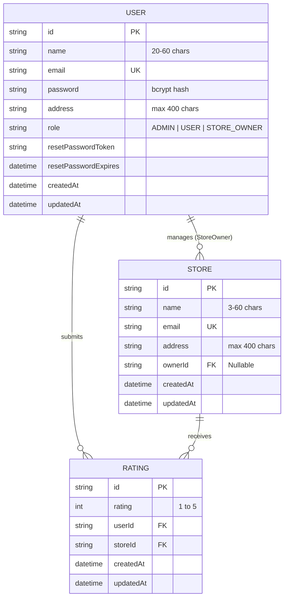

# StoreRate Pro - Enterprise Full-Stack Store Rating Web Application

[](https://react.dev/)
[](https://expressjs.com/)
[](https://www.prisma.io/)
[](https://tailwindcss.com/)
[](https://www.typescriptlang.org/)
[](https://vercel.com/)

A production-grade, industry-standard full-stack web application for discovering and rating retail stores with **Role-Based Access Control (RBAC)** for **System Administrators**, **Store Owners**, and **Normal Users**.

---

## 🚀 Live Demo Test Accounts

The platform includes a **1-Click Test Credentials Selector** on the login page for instant reviewer testing:

| Role | Email Address | Password | Functionalities & Permissions |
| :--- | :--- | :--- | :--- |
| 👑 **System Administrator** | `admin@storerating.com` | `Admin@2026!` | Full dashboard KPIs, add/edit/delete users & stores, sortable & filterable user/store management tables, user details modal with store ratings. |
| 🏪 **Store Owner** | `alexander.hamilton@stores.com` | `Owner@2026!` | Store analytics dashboard, overall store average rating, star rating distribution chart, list of customer reviews with search & sort. |
| 👤 **Normal User** | `user@storerating.com` | `User@2026!` | Search stores by name & address, submit 1-5 star ratings, modify existing ratings, update password. |

---

## 🛠 Tech Stack

- **Backend**: Express.js with TypeScript, Clean Architecture, RESTful API design.
- **Database & ORM**: PostgreSQL / SQLite with Prisma ORM, migrations, and realistic seed data.
- **Frontend**: React 18, Vite, TypeScript, Tailwind CSS, Lucide Icons, React Router v6, Axios with token interceptors.
- **Security & Validation**: JWT token authentication, bcrypt password hashing, Zod schema validation, Helmet headers, CORS.

---

## 🔒 Form Validations & Business Rules

All validation rules are strictly enforced on both **Frontend** and **Backend**:

- **Name**: Minimum 20 characters, maximum 60 characters.
- **Address**: Maximum 400 characters.
- **Password**: 8–16 characters, must include at least **1 uppercase letter** and **1 special character** (`!@#$%^&*()_+-=[]{};':"|,.<>/?`).
- **Email**: Standard RFC email format.
- **Ratings**: Integer values from 1 to 5.
- **Password Eye Button**: Universal toggle button on all password fields across login, register, forgot/reset password, profile, and admin modals.
- **Admin Delete Controls**: Admin can safely delete users and stores with relational integrity and self-deletion prevention.

---

## 🏗 Architecture & Database Schema



---

## 📡 REST API Documentation

### 🔐 Authentication & Profile (`/api/auth`)
- `POST /api/auth/register`: Register new Normal User (name 20-60 chars, address max 400 chars, password rules).
- `POST /api/auth/login`: Single login endpoint for all roles.
- `GET /api/auth/me`: Get current authenticated profile.
- `PUT /api/auth/change-password`: Update password (validating old password & new password criteria).
- `POST /api/auth/forgot-password`: Generates secure crypto 1-hour reset token.
- `POST /api/auth/reset-password`: Resets password using valid token.

### 👑 System Administrator (`/api/admin` - Protected: `ADMIN`)
- `GET /api/admin/dashboard`: Total users, stores, ratings counts, average platform score, recent activity.
- `GET /api/admin/users`: List users with name/email/address search, role filter (`ADMIN`, `USER`, `STORE_OWNER`), sorting (`name`, `email`, `address`, `role`, `createdAt`), and store owner rating.
- `GET /api/admin/users/:id`: Detailed user profile with store ownership metrics & submitted ratings history.
- `POST /api/admin/users`: Create Admin, Normal User, or Store Owner (with optional store assignment).
- `PUT /api/admin/users/:id`: Edit user details, role, password, and store assignment.
- `DELETE /api/admin/users/:id`: Delete user account (with cascade cleanup & self-deletion guard).
- `GET /api/admin/stores`: List stores with search, sorting (`name`, `email`, `address`, `rating`), and owner information.
- `POST /api/admin/stores`: Create store entity.
- `PUT /api/admin/stores/:id`: Update store details & owner assignment.
- `DELETE /api/admin/stores/:id`: Delete store and cascade associated ratings.

### 🏪 Store Owner (`/api/owner` - Protected: `STORE_OWNER`, `ADMIN`)
- `GET /api/owner/dashboard`: Store information, overall average score, 1-5 star ratings distribution breakdown, and list of users who submitted reviews.

### 👤 Stores & Ratings (`/api/stores` & `/api/ratings`)
- `GET /api/stores`: Browse stores with search by name/address, sorting, overall rating, and current user's submitted rating.
- `GET /api/stores/:id`: Single store detail view with ratings breakdown.
- `POST /api/ratings`: Submit or modify rating (1–5) for a store.
- `GET /api/ratings/my`: Get all ratings submitted by the logged-in user.

---

## 💻 Local Installation & Setup

### Prerequisites
- [Node.js](https://nodejs.org/) v18+ (Tested on v20 & v24)
- npm v9+

### Quick Start (3 Steps)

1. **Clone the Repository**:
   ```bash
   git clone https://github.com/aryansheth18/Full-Stack-Final-Project.git
   cd Full-Stack-Final-Project
   ```

2. **Install All Dependencies & Seed Database**:
   ```bash
   # Install root, backend, and frontend dependencies
   npm run install:all

   # Setup database schema and seed demo accounts
   npm run seed
   ```

3. **Start Development Servers**:
   ```bash
   npm run dev
   ```
   - **Frontend**: [http://localhost:5173](http://localhost:5173)
   - **Backend API**: [http://localhost:5000](http://localhost:5000)

---

## 🧪 Automated Testing

Run the end-to-end integration test suite verifying authentication, RBAC, validations, CRUD operations, rating submission, and password reset:

```bash
cd server
node test-api.js
```

---

## ☁️ Deployment Guide (Vercel)

1. Push code to your GitHub repository:
   ```bash
   git add .
   git commit -m "feat: complete enterprise fullstack store rating platform"
   git push -u origin main
   ```

2. Go to [Vercel Dashboard](https://vercel.com/dashboard) and click **"Add New Project"**.
3. Select your repository `Full-Stack-Final-Project`.
4. Add Environment Variables:
   - `JWT_SECRET`: `your_production_secret_key`
   - `DATABASE_URL`: Your PostgreSQL connection string (e.g. from [Neon.tech](https://neon.tech) or [Supabase](https://supabase.com))
   - `NODE_ENV`: `production`
5. Click **Deploy**.

---

## 👨‍💻 Author

**Aryan Sheth**  
- GitHub: [@aryansheth18](https://github.com/aryansheth18)
- Repository: [https://github.com/aryansheth18/Full-Stack-Final-Project](https://github.com/aryansheth18/Full-Stack-Final-Project)
